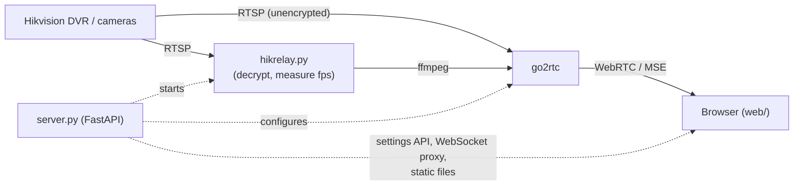

# Sentinel Eye

A self-hosted web dashboard for Hikvision recorders and cameras — live viewing, DVR playback and review,
event search, exports, and real-time AI-assisted enhancement, all running on your own machine.

No Hikvision app, no plugin, and no cloud account. It reads the recorder's standard RTSP streams over your
LAN and, when the recorder's proprietary "Stream Encryption" is turned on, decrypts them itself (the scheme
was reverse-engineered from scratch — see `tools/NOTES.md`). Nothing about how you watch or review your
cameras ever leaves your network.

## Why

Hikvision's own apps and cloud are the alternative to this project, not a neutral baseline. Sentinel Eye
exists to replace them outright: everything the vendor's software does — live view, recorded playback,
motion/event review, clip export, and increasingly AI-assisted analysis — running entirely on hardware you
control, with the recorder's proprietary encryption decrypted locally instead of trusted to a vendor plugin.

It is a single-operator tool by design: there is no login system, and it is meant to run on `127.0.0.1` or
a network you already trust, not to be exposed publicly.

## Features

### Live view
- Grid layouts from 1x1 up to 4x4, plus 1+5, 1+7 and 2+8 (one large tile, several small ones); multiple
  pages when you have more cameras than fit on one screen, with auto-rotation between pages.
- Drag tiles to reorder them ("Arrange" mode); the order is saved and used everywhere else in the app.
- Per-tile SD / HD / Auto quality (Auto uses HD only for large tiles, SD for small ones, to keep bandwidth
  sane on a big wall of cameras).
- A large "focus" view for any camera, with snapshot, full screen, and camera-to-camera navigation.
- Zoom and pan on any tile or the large view — scroll wheel, trackpad pinch, touch pinch, mouse drag, or the
  on-screen controls — without ever pausing the picture.
- Instant replay: jump back up to a configurable window on any live camera without leaving the grid.
- Live event badges (motion, line-crossing, tamper, video loss) painted directly onto the relevant tile.

### Playback and review
- Review up to four cameras at once, frame-locked — the recorder's own hard limit on simultaneous playback
  sessions, not a limit this project imposes.
- A zoomable, scrollable timeline showing recorded coverage and events per camera, click-to-seek, and
  frame-accurate stepping forward and backward.
- Variable speed from 1/8x up to 16x, rewind macros, and a "select a range" tool for exporting exactly the
  footage you need.
- A multi-cut clipper: build a list of ranges from several points in the timeline, then export them all as
  one batch.
- Bookmarks and incident notes you can attach to a moment on any camera, searchable later.

### Event search
- Search motion, line-crossing, tamper and video-loss events (and your own bookmarks) across cameras and
  date ranges, with thumbnail or list views and a quick in-page preview before committing to a full export.

### Export
- Every export is a stream copy of the original footage — no re-encoding, no quality loss.
- **Signed evidence package** (recommended): the clip, a `manifest.json` covering every file's SHA-256 hash,
  the exact camera and DVR time range, and an Ed25519 signature over that manifest, plus an offline
  `verify.html` that checks it all in a browser with nothing installed and no server involved.
- **Plain MP4/MKV**: just the clip, for a quick look.

### Real-time enhancement ("the wand")
A WebGL filter chain that runs live, on the playing picture, at zero cost when switched off:
brightness/contrast/gamma, edge-aware sharpen, noise reduction, dark-channel-inspired dehaze, CLAHE-style
local contrast, digital WDR (highlight rolloff for backlit scenes), single-scale Retinex illumination
correction, temporal rain/snow-streak reduction, chromatic-aberration correction, and auto white balance
(corrects the color cast IR-lit night footage typically has). Every control is an independently adjustable,
stackable slider — presets are just one-click starting points, including one tuned for grainy, color-cast
IR night footage.

### AI frame enhancer
From a single paused frame (or a short burst, aligned and fused first for noise reduction), a local
Real-ESRGAN + GFPGAN pipeline produces the clearest, highest-resolution version of that moment it can —
useful for faces and license plates. It runs entirely on this machine, never calls out to the cloud, and
every output is explicitly labeled "ENHANCED" with the original frame always kept alongside it: the
distinction between "what the sensor recorded" and "the AI's best reconstruction of it" is never blurred.

### Settings
Recorder address and login, the encryption toggle and verification code, per-channel names/order/frame-rate
overrides and custom RTSP paths, a "detect channels" scan (also reads the recorder's own camera names),
theme and layout defaults, and live connection/engine status.

### Keyboard shortcuts

Live view (grid):

| Key | Action | | Key | Action |
|---|---|---|---|---|
| `1`-`9` | Open that camera | | `E` | Toggle arrange mode |
| `←` / `→` | Previous / next page | | `F` | Full screen |
| `Esc` | Leave arrange mode | | | |

Live view (large/focus view) and Playback:

| Key | Action | | Key | Action |
|---|---|---|---|
| `Space` | Play / pause (Playback) | | `S` | Snapshot (Live) |
| `←` / `→` | Previous / next camera (Live) | | `B` | Bookmark this moment |
| `,` / `.` | Step one frame back / forward (Playback) | | `H` | Toggle SD/HD (Live) |
| `+` / `-` / `0` | Zoom in / out / reset (Live) | | `F` | Full screen |
| `Shift` + `1`/`2`/`3` | Back 5s / 10s / 30s (Playback) | | `Esc` | Reset zoom, then close |
| `Shift` + `4`/`5`/`6` | Forward 5s / 10s / 30s (Playback) | | | |

## How it works



The decrypting relay only runs when the recorder's Stream Encryption is turned on; otherwise go2rtc pulls
each camera directly. A few key files:

| File | Responsibility |
|---|---|
| `app/server.py` | FastAPI app: settings API, connection test, WebSocket proxy, static UI |
| `app/hikrelay.py` | The decrypting relay (`tools/NOTES.md` documents the reverse-engineered scheme) |
| `app/go2rtc.py` | Generates go2rtc's config from current settings and restarts it on change |
| `app/playback_session.py`, `app/timebase.py` | DVR playback sessions and the RTP-to-UTC clock calibration that makes multi-camera playback frame-locked |
| `app/export.py` | Stream-copy export, manifest generation, Ed25519 signing |
| `app/enhance_ai.py` | The local Real-ESRGAN/GFPGAN frame enhancer |
| `web/` | Plain ES modules, no build step, no framework |

SD streams stay connected at all times (needed for event/coverage indexing); HD streams start only when
actually viewed. HD is H.265 on the wire, transcoded to H.264 on this machine so it plays smoothly in every
browser — playing the original H.265 directly is an opt-in setting for lower CPU use.

## Running it

### Requirements
- macOS (Apple Silicon or Intel) with [Homebrew](https://brew.sh)
- Python 3
- A Hikvision DVR/NVR or camera reachable over RTSP on your network

### Install

```sh
brew install ffmpeg
python3 -m venv .venv && .venv/bin/pip install -r requirements.txt
```

`bin/go2rtc` (the [go2rtc](https://github.com/AlexxIT/go2rtc) media server) is already vendored in this
repo for macOS; nothing else to install for it.

### Configure

The first time you start it, Sentinel Eye seeds `data/settings.json` from a `.env` file in the project root,
if one exists:

```sh
DVR_HOST=192.0.2.10
DVR_USER=admin
DVR_PASS=your-password
DVR_KEY=your-stream-encryption-verification-code   # only needed if Stream Encryption is on
```

`.env` is only read on that very first run — after that, everything (recorder address, login, encryption,
channels, display options) is edited from the in-app **Settings** screen. `data/` holds your credentials
(file mode 600) and is git-ignored; never commit it.

### Run

```sh
./run.sh
```

Opens on **http://127.0.0.1:8007**. There is no login, so keep this on `127.0.0.1` or a network you trust —
do not expose it to the public internet. Set `SENTINEL_HOST`/`SENTINEL_PORT` to change the listen address:

```sh
SENTINEL_PORT=8090 ./run.sh
```

### Watching from your phone (or another device on your network)

```sh
SENTINEL_HOST=0.0.0.0 ./run.sh
```

Then, on your phone (connected to the **same Wi-Fi**), browse to `http://<this-machine's-LAN-IP>:8007` — find
the IP with `ipconfig getifaddr en0` (Wi-Fi) on the Mac.

Because there is still no login, this makes the dashboard — and your camera feeds — reachable by **anything
else on that network**, not just your phone: other devices on the same Wi-Fi, a guest network if it shares
the same subnet, or anyone who has the Wi-Fi password. Only do this on a Wi-Fi network you actually trust,
the same way you'd trust it with any other unauthenticated home device. Do not port-forward this to the
public internet.

### Stop

```sh
./stop.sh
```

Stops the web server, go2rtc, and any decrypt-relay/ffmpeg processes it started.

The frontend is plain JavaScript with no build step, so a UI change just needs a browser refresh; only a
backend (Python) change needs `./stop.sh && ./run.sh`.

## Testing

```sh
tools/test_rig.sh start                              # isolated instance against a fake unencrypted camera
python tools/e2e_ui.py http://127.0.0.1:8081 <shotdir>   # ~40 browser checks via headless Chrome (CDP)
```

`tools/e2e_live.py` and `tools/e2e_real_settings.py` check against your real recorder without changing
anything on it.

## Project status

Live viewing, multi-camera DVR playback with frame-locked timing, event search, signed-package export, the
real-time enhancement filters, and the local AI frame enhancer are all built and in day-to-day use. The
detailed specification and its build status live in `docs/playback-spec.md` — including the parts
deliberately not built (a native-DVR-file export option, and a standalone offline player), and one open
investigation into a rare timing edge case on footage recorded many hours before the most recent per-channel
clock calibration.
