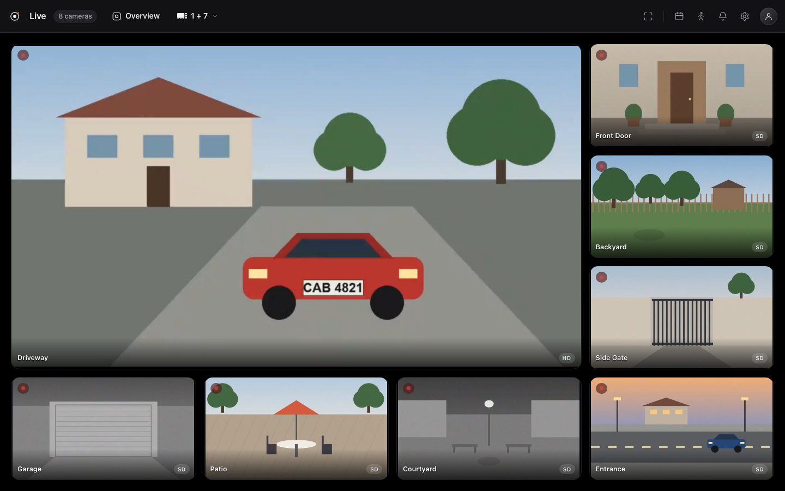
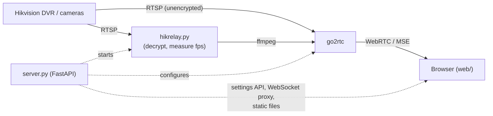
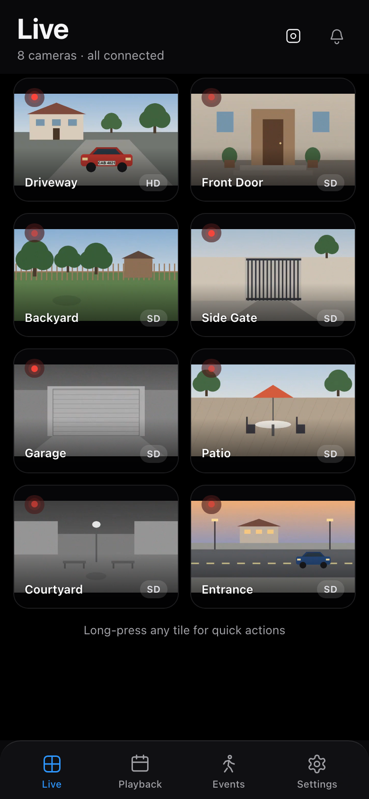
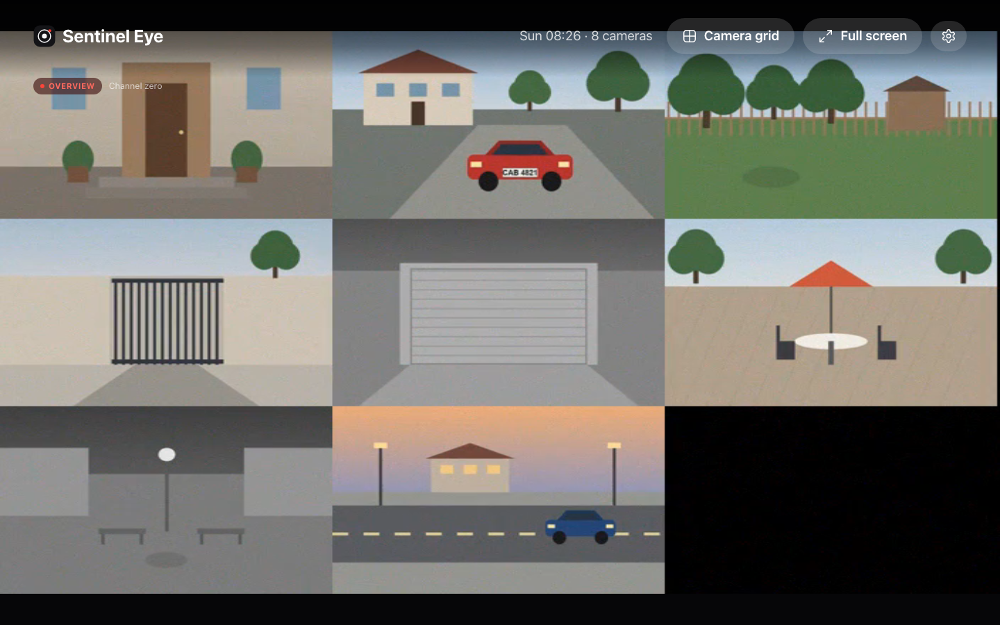

# Sentinel Eye

A self-hosted web dashboard for Hikvision recorders and cameras — live viewing, DVR playback and review,
event search, exports, and real-time AI-assisted enhancement, all running on your own machine.

<br clear="left">

No Hikvision app, no plugin, and no cloud account. It reads the recorder's standard RTSP streams over your
LAN and, when the recorder's proprietary "Stream Encryption" is turned on, decrypts them itself (the scheme
was reverse-engineered from scratch — see `tools/NOTES.md`). Nothing about how you watch or review your
cameras ever leaves your network.



*(Screenshot uses generic placeholder scenes and camera names, not real footage — see [Installing as an
app](#installing-as-an-app) for what it looks like installed on a phone or a TV.)*

## Why

Hikvision's own apps and cloud are the alternative to this project, not a neutral baseline. Sentinel Eye
exists to replace them outright: everything the vendor's software does — live view, recorded playback,
motion/event review, clip export, and increasingly AI-assisted analysis — running entirely on hardware you
control, with the recorder's proprietary encryption decrypted locally instead of trusted to a vendor plugin.

Built for my own needs first. Out of the box there's no login and it's meant for `127.0.0.1` or a network
you already trust; [sign-in](#sign-in-optional) is one form away when other people, a TV, or a tunnel get
involved.

## Features

### Live view
- Grid layouts from 1x1 up to 4x4, plus 1+5, 1+7 and 2+8 (one large tile, several small ones); multiple
  pages when you have more cameras than fit on one screen, with auto-rotation between pages.
- Drag tiles to reorder them ("Arrange" mode); the order is saved and used everywhere else in the app.
- Per-tile SD / HD / Auto quality (Auto uses HD only for large tiles, SD for small ones, to keep bandwidth
  sane on a big wall of cameras).
- A large "focus" view for any camera, with snapshot, full screen, and camera-to-camera navigation.
- Zoom and pan on any tile or the large view — scroll wheel, trackpad pinch, touch pinch, mouse drag, or the
  on-screen controls — without ever pausing the picture.
- Instant replay: jump back up to a configurable window on any live camera without leaving the grid.
- Live event badges (motion, line-crossing, tamper, video loss) painted directly onto the relevant tile.
- **Channel-zero** (Settings → Connection, on recorders that support it): the recorder's own single-stream
  overview of every camera at once — the same picture a monitor plugged straight into it would show. An
  "Overview" toggle in the live view shows it as the first tile — off by default on a phone, tablet, or
  laptop; TV mode always shows it, full screen, since a single low-bandwidth stream is exactly what a weak
  TV browser wants. It has no recording of its own, so there's no instant replay for it, and bookmarking it
  bookmarks every real camera at once instead.
- **TV mode** (Settings → Display): a bigger, remote-friendly layout for watching from a smart TV's browser
  or just a bigger screen — larger text, arrow-key camera selection, page switching and an exit button while
  full screen, and SD by default to keep a weaker TV browser smooth (HD is a real, working choice from the
  same quality control, not just cosmetic). Defaults straight into Channel-zero's single-stream view when
  your recorder offers it. Per-browser, so turning it on for the TV doesn't change anything on your phone or
  laptop. More on this in [Installing as an app](#installing-as-an-app).

### Playback and review
- Review up to four cameras at once, frame-locked — the recorder's own hard limit on simultaneous playback
  sessions, not a limit this project imposes.
- A zoomable, scrollable timeline showing recorded coverage and events per camera, click-to-seek, and
  frame-accurate stepping forward and backward.
- Variable speed from 1/8x up to 16x, rewind macros, and a "select a range" tool for exporting exactly the
  footage you need.
- A multi-cut clipper: build a list of ranges from several points in the timeline, then export them all as
  one batch.
- Bookmarks and incident notes you can attach to a moment on any camera, searchable later.

### Event search
- Search motion, line-crossing, tamper and video-loss events (and your own bookmarks) across cameras and
  date ranges, with thumbnail or list views and a quick in-page preview before committing to a full export.

### Export
- Every export is a stream copy of the original footage — no re-encoding, no quality loss.
- **Signed evidence package** (recommended): the clip, a `manifest.json` covering every file's SHA-256 hash,
  the exact camera and DVR time range, and an Ed25519 signature over that manifest, plus an offline
  `verify.html` that checks it all in a browser with nothing installed and no server involved.
- **Plain MP4/MKV**: just the clip, for a quick look.

### Real-time enhancement ("the wand")
A WebGL filter chain that runs live, on the playing picture, at zero cost when switched off:
brightness/contrast/gamma, edge-aware sharpen, noise reduction, dark-channel-inspired dehaze, CLAHE-style
local contrast, digital WDR (highlight rolloff for backlit scenes), single-scale Retinex illumination
correction, temporal rain/snow-streak reduction, chromatic-aberration correction, and auto white balance
(corrects the color cast IR-lit night footage typically has). Every control is an independently adjustable,
stackable slider — presets are just one-click starting points, including one tuned for grainy, color-cast
IR night footage.

### AI frame enhancer
From a single paused frame (or a short burst, aligned and fused first for noise reduction), a local
Real-ESRGAN + GFPGAN pipeline produces the clearest, highest-resolution version of that moment it can —
useful for faces and license plates. It runs entirely on this machine, never calls out to the cloud, and
every output is explicitly labeled "ENHANCED" with the original frame always kept alongside it: the
distinction between "what the sensor recorded" and "the AI's best reconstruction of it" is never blurred.

### Settings
Recorder address and login, the encryption toggle and verification code, per-channel names/order/frame-rate
overrides and custom RTSP paths, a "detect channels" scan (also reads the recorder's own camera names),
theme and layout defaults, and live connection/engine status. With [sign-in](#sign-in-optional) on,
Security holds accounts, paired TVs, sessions, network access and an activity log.

### Keyboard shortcuts

Live view (grid):

| Key | Action | | Key | Action |
|---|---|---|---|---|
| `1`-`9` | Open that camera | | `E` | Toggle arrange mode |
| `←` / `→` | Previous / next page | | `F` | Full screen |
| `Esc` | Leave arrange mode | | | |

Live view (large/focus view) and Playback:

| Key | Action | | Key | Action |
|---|---|---|---|
| `Space` | Play / pause (Playback) | | `S` | Snapshot (Live) |
| `←` / `→` | Previous / next camera (Live) | | `B` | Bookmark this moment |
| `,` / `.` | Step one frame back / forward (Playback) | | `H` | Toggle SD/HD (Live) |
| `+` / `-` / `0` | Zoom in / out / reset (Live) | | `F` | Full screen |
| `Shift` + `1`/`2`/`3` | Back 5s / 10s / 30s (Playback) | | `Esc` | Reset zoom, then close |
| `Shift` + `4`/`5`/`6` | Forward 5s / 10s / 30s (Playback) | | | |

## How it works


```mermaid
flowchart LR
    DVR["Hikvision DVR / cameras"] -- "RTSP" --> Relay["hikrelay.py<br/>(decrypt, measure fps)"]
    DVR -- "RTSP (unencrypted)" --> Go2rtc
    Relay -- "ffmpeg" --> Go2rtc["go2rtc"]
    Go2rtc -- "WebRTC / MSE" --> Browser["Browser (web/)"]
    Server["server.py (FastAPI)"] -. "settings API, WebSocket proxy,<br/>static files" .-> Browser
    Server -. "configures" .-> Go2rtc
    Server -. "starts" .-> Relay
```

The decrypting relay only runs when the recorder's Stream Encryption is turned on; otherwise go2rtc pulls
each camera directly. A few key files:

| File | Responsibility |
|---|---|
| `app/server.py` | FastAPI app: settings API, connection test, WebSocket proxy, static UI |
| `app/hikrelay.py` | The decrypting relay (`tools/NOTES.md` documents the reverse-engineered scheme) |
| `app/go2rtc.py` | Generates go2rtc's config from current settings and restarts it on change |
| `app/playback_session.py`, `app/timebase.py` | DVR playback sessions and the RTP-to-UTC clock calibration that makes multi-camera playback frame-locked |
| `app/export.py` | Stream-copy export, manifest generation, Ed25519 signing |
| `app/enhance_ai.py` | The local Real-ESRGAN/GFPGAN frame enhancer |
| `app/auth.py`, `app/auth_api.py` | Optional sign-in: accounts, roles, TOTP, sessions, TV pairing, and the per-route role checks |
| `app/hwaccel.py` | Picks the H.264 encoder for the live transcode (NVENC, VA-API, V4L2, VideoToolbox, or CPU) |
| `web/` | Plain ES modules, no build step, no framework |

SD streams stay connected at all times (needed for event/coverage indexing); HD streams start only when
actually viewed. HD is H.265 on the wire, transcoded to H.264 on this machine so it plays smoothly in every
browser — playing the original H.265 directly is an opt-in setting for lower CPU use.

## Running it

### Requirements
- **Docker** (the default): Docker Engine with the Compose plugin on Linux, or Docker Desktop on macOS with
  host networking enabled (Settings > Resources > Network). The image bundles Python, ffmpeg and go2rtc.
- **Or native** (`--native`): Python 3 and ffmpeg (`brew install ffmpeg` on macOS). Built and tested on
  macOS; native Linux (x86_64/arm64) is supported by `run.sh` but hasn't been verified yet.
- A Hikvision DVR/NVR or camera reachable over RTSP on your network

### `run.sh`: the whole lifecycle

```sh
./run.sh                 # = ./run.sh start: build/prepare if needed, start in the background, wait until healthy
./run.sh status          # running? healthy?
./run.sh logs            # follow the server log (go2rtc's is data/go2rtc.log)
./run.sh stop            # ./stop.sh does the same
./run.sh restart
./run.sh update          # git pull, rebuild / reinstall dependencies, restart if it was running
./run.sh backup          # data/ (settings, credentials, accounts, signing key, playback index) to backups/*.tar.gz
./run.sh setup           # just the preparation step of start
./run.sh shell           # Docker only: a shell inside the container
./run.sh clean           # remove the container + image (native: .venv and bin/go2rtc); data/ is kept
./run.sh help
```

Every command runs in Docker unless you add `--native` (or export `SENTINEL_MODE=native`), which runs the
server straight from a `.venv` on this machine instead: `./run.sh --native start`. Native `setup` creates
`.venv`, installs `requirements.txt` and fetches the right [go2rtc](https://github.com/AlexxIT/go2rtc) binary
for your OS and CPU into `bin/go2rtc`; `./run.sh --native run` runs it in the foreground (Ctrl-C stops it),
logging to the terminal instead of `data/sentinel.log`. `stop`, `status` and `logs` pick native on their own
when a native instance is running. Only one of the two can run at a time, since they share ports.

`backup` archives contain the DVR password; `backups/` is git-ignored and created with owner-only access.

### Configure

The first time you start it, Sentinel Eye seeds `data/settings.json` from a `.env` file in the project root,
if one exists (`run.sh` also passes it into the container on that first Docker start):

```sh
DVR_HOST=192.0.2.10
DVR_USER=admin
DVR_PASS=your-password
DVR_KEY=your-stream-encryption-verification-code   # only needed if Stream Encryption is on
```

`.env` is only read on that very first run — after that, everything (recorder address, login, encryption,
channels, display options) is edited from the in-app **Settings** screen. `data/` holds your credentials
(file mode 600) and is git-ignored; never commit it.

### AI frame enhancer (optional, native only)

Everything above is all you need for live view, playback, export, and the real-time "wand" filters. The
[AI frame enhancer](#ai-frame-enhancer) (Real-ESRGAN + GFPGAN, plus optional OCR) is a separate, heavier
opt-in — it pulls in PyTorch and ~1.5 GB of model weights, and one of its dependencies
([basicsr](https://github.com/XPixelGroup/BasicSR), effectively unmaintained since 2022) needs a couple of
small local patches to install and run on current Python. It isn't in the Docker image. All of that is
scripted:

```sh
./run.sh --native setup
tools/install_enhance_deps.sh
```

Run it once. If you skip this, everything else works normally; only the frame-enhancer button will report
it's unavailable.

### Listen address and port

Opens on **http://127.0.0.1:8007**. Until you turn on [sign-in](#sign-in-optional) there is no login, so
keep it on `127.0.0.1` or a network you trust. Set `SENTINEL_HOST`/`SENTINEL_PORT` to change the listen address
(default `0.0.0.0`, all interfaces), in either mode:

```sh
SENTINEL_HOST=127.0.0.1 SENTINEL_PORT=8090 ./run.sh restart
```

### Watching from your phone (or another device on your network)

With the default `SENTINEL_HOST=0.0.0.0`, on your phone (connected to the **same Wi-Fi**) browse to
`http://<this-machine's-LAN-IP>:8007` — find the IP with `ipconfig getifaddr en0` (Wi-Fi) on a Mac.

Without [sign-in](#sign-in-optional), this makes the dashboard — and your camera feeds — reachable by
**anything else on that network**, not just your phone: other devices on the same Wi-Fi, a guest network if
it shares the same subnet, or anyone who has the Wi-Fi password. Only leave it open on a Wi-Fi network you
actually trust; otherwise turn sign-in on first.

The frontend is plain JavaScript with no build step. Natively a UI change just needs a browser refresh and a
backend (Python) change needs `./run.sh --native restart`; in Docker both need `./run.sh update` (the code is
baked into the image).

### GPU acceleration

With the default "convert H.265 on the server" setting, every camera's main stream is re-encoded to H.264
live, which is the heaviest thing the server does. At startup it picks the H.264 encoder by running a short
test encode on each candidate, and uses the first one that works:

- **macOS:** VideoToolbox.
- **Linux:** NVIDIA (NVENC), then Intel/AMD (VA-API, via `/dev/dri`), then V4L2 M2M (e.g. Raspberry Pi),
  and the CPU (libx264) when none works.

Only encoding moves to the GPU; decoding stays on the CPU on purpose (a hardware H.265 decoder has already
choked on this DVR's stream once). `./run.sh status` and `/api/status` show the choice (`encoder:` /
`"hwaccel"`), and the server log says which one it picked at startup. Force one with
`SENTINEL_HWACCEL=nvenc|vaapi|v4l2m2m|videotoolbox|cpu`; if the forced one fails its test encode, it falls
back to the CPU and logs why.

In Docker, `./run.sh` passes the host's GPU into the container on Linux by itself: `/dev/dri` (with the
render node's group, so the container user can open it) and, when the
[NVIDIA Container Toolkit](https://docs.nvidia.com/datacenter/cloud-native/container-toolkit/latest/install-guide.html)
is installed, the NVIDIA GPU. It writes that to `compose.gpu.yaml` (git-ignored); with plain
`docker compose`, add `-f compose.gpu.yaml` after `./run.sh setup` has generated it. `SENTINEL_GPU=off`
skips the passthrough. Docker Desktop (macOS) can't pass a GPU through, so there it's always the CPU; run
natively to get VideoToolbox. Natively on Linux, your user needs to be in the render node's group (usually
`render`), which `./run.sh --native setup` warns about.

### Run on a Linux VM with Docker

Tested target: Ubuntu on amd64 with Docker Engine and the Compose plugin. The image is multi-arch
(amd64/arm64) and bundles Python, ffmpeg, go2rtc and the VA-API drivers (see *GPU acceleration*). The [AI frame enhancer](#ai-frame-enhancer) is not
included. The VM must be able to reach the recorder's IP directly (same LAN or routed).

```sh
git clone https://github.com/dsameendra/sentinel-eye.git && cd sentinel-eye
./run.sh    # builds the image, gives data/ to UID 1000 (asks for sudo once), starts, waits until healthy
```

Then open `http://<vm-ip>:8007` and enter the recorder in **Settings**. The container uses host
networking, so on your LAN/VPN live view gets WebRTC exactly like a native install.

**Playback needs HTTPS or localhost.** Browsers only enable WebCodecs, which Playback, event previews and
instant replay decode with, on a secure origin. On plain `http://<vm-ip>:8007` live view works, but
recordings don't. Either put it behind HTTPS (see *Reaching it from the internet* below), or use an SSH tunnel
from your computer, `ssh -N -L 8007:127.0.0.1:8007 <vm>`, and open `http://localhost:8007`.

- **Seeding from `.env` instead:** create `.env` before the first `./run.sh` (see *Configure*). With plain
  `docker compose`, uncomment the `./.env:/app/.env:ro` line in `compose.yaml` for the first start instead,
  and remove it afterwards.
- **Moving an existing install:** stop the old one, copy its whole `data/` directory to the VM, and
  `sudo chown -R 1000:1000 data`. Keeping `export_signing_key.pem` keeps earlier exports verifiable.
- **Settings via environment** (exported in the shell before `./run.sh start`, or edited in
  `compose.yaml`): `SENTINEL_HOST` (default `0.0.0.0`; set it to a VPN address to listen only there),
  `SENTINEL_PORT` (default `8007`), `TZ` (log timestamps only, since the app takes its time zone from the
  recorder), `SENTINEL_DATA_DIR` (host path, default `./data`), `SENTINEL_ADMIN_USER` /
  `SENTINEL_ADMIN_PASSWORD` (turn [sign-in](#sign-in-optional) on at first start).
- **Logs:** `./run.sh logs` (server), `data/go2rtc.log` (go2rtc).
- **Update:** `./run.sh update`. **Stop:** `./run.sh stop`. Plain `docker compose` works too; `run.sh`
  only wraps it.
- **Tests:** `tools/test_docker_image.sh`, `tools/test_docker_compose.sh`,
  `.venv/bin/python3 tools/test_hwaccel.py` (encoder selection, no GPU needed), and the sign-in suites
  (see [Testing](#testing)).

**Reaching it from the internet:** turn [sign-in](#sign-in-optional) on first (ideally with two-factor
for admins), and never publish port 8007 directly: put it behind a reverse proxy or tunnel that terminates
HTTPS and passes WebSocket upgrades for `/ws` and `/api/playback/ws`. If you'd rather have single sign-on,
the proxy can authenticate too (Cloudflare Access, oauth2-proxy, …) in front of or instead of the built-in
sign-in. Through an HTTP-only tunnel WebRTC can't connect, and the player falls back to MSE over that
WebSocket automatically (slightly more latency, same picture).

## Sign-in (optional)

Off by default: with no accounts, everyone who can reach the address is effectively an admin, exactly as
before. It turns on the moment the first account exists, either from **Settings → Security → Turn on
sign-in**, or at start-up with `SENTINEL_ADMIN_PASSWORD` (and optionally `SENTINEL_ADMIN_USER`, default
`admin`) in the environment — used only while there are no accounts, so leaving it set never overwrites a
password changed later.

| | Viewer | Operator | Admin |
|---|:-:|:-:|:-:|
| Live view, snapshots, zoom, instant replay | ✅ | ✅ | ✅ |
| Playback, event search, bookmarks, exports, frame enhancer | | ✅ | ✅ |
| Shared layout and camera order | | ✅ | ✅ |
| Recorder connection, channels, all settings, accounts | | | ✅ |

The server enforces this on every request and WebSocket; the interface just hides what you can't use. A
viewer's copy of the settings doesn't include the recorder's address or login.

- **Two-factor authentication:** each person can turn it on from the account menu (any authenticator app),
  with ten single-use recovery codes. **Require two-factor for admins** makes it mandatory for them.
- **TVs and shared screens:** on the TV, open the address and pick **Pair this device** (TV-mode browsers go
  straight there). It shows a code and a QR; an admin scans it or opens `/pair` on their phone, names the
  device and chooses Viewer or Operator. No password is typed on the TV, and it stays signed in for a year
  of use. Removing it in Settings → Security cuts its streams right away.
- **Sessions:** "Keep me signed in" lasts 30 days of use, otherwise 12 hours (both adjustable). Everyone can
  see and sign out their own devices; admins see all of them. Changing a password signs out your other
  devices.
- **Trusted networks:** optionally let a LAN (e.g. `192.168.1.0/24`) in without signing in, as Viewer or
  Operator, never Admin. Requests that came through a proxy or tunnel always sign in, even from a listed
  address: a tunnel running on the same machine makes internet traffic arrive from `127.0.0.1`, which is why
  that address is only trusted if you list it, and Security warns when you do.
- **Reverse proxies:** list their addresses under *Reverse proxies* so the activity log shows real client
  addresses and cookies get the `Secure` flag behind HTTPS.
- **Locked out?** On the server (inside Docker: `./run.sh shell`, or `docker compose exec sentinel-eye …`):

  ```sh
  python app/auth.py reset-password admin     # also: list-users, disable-2fa <user>,
                                              #       revoke-sessions <user>, disable-auth
  ```

Accounts, sessions and the activity log live in `data/auth.db` (passwords as scrypt hashes, session tokens
only as hashes); `./run.sh backup` includes it.

## Installing as an app

Sentinel Eye installs as a standalone app on iPhone, iPad, and Mac — no App Store, just the browser's own
install mechanism:

- **iPhone / iPad (Safari):** Share → **Add to Home Screen**.
- **Mac (Safari, Chrome, or Edge):** the browser's install button, or Safari's **Add to Dock**.

It opens full-screen with its own icon and no address bar, and still talks directly to your own Mac over
your network — installing it changes nothing about how or where data moves.

<p align="center"></p>

### Channel-zero: the recorder's own overview

If your recorder supports it, Settings → Connection → **Channel-zero** turns on a single stream showing the
recorder's own multi-camera layout — the same picture a monitor plugged straight into it would show, at
whatever resolution the recorder itself encodes it at (confirmed directly against a real 8-channel NVR:
704×576, distinct from any individual camera's own main or sub stream). Once it's on, an **Overview** toggle
appears in the live view's toolbar — off by default, so enabling it on the recorder doesn't suddenly add a
tile to every device watching it. Turn it on and it becomes the first tile in the grid; a second toggle next
to it switches between that grid and Channel-zero filling the whole screen by itself. It isn't a real
recorded channel, so there's no instant replay for it, and bookmarking it bookmarks every real camera at
once instead — the closest honest equivalent to "this moment," since it has no timeline of its own to find
a bookmark on later.

### TV mode

Settings → Display → **TV mode** switches to a bigger, remote-friendly layout for watching on a smart TV's
browser (or just a bigger screen): larger text and camera names, arrow-key camera selection instead of a
mouse, and SD by default — most smart TV browsers (this was built and tested against Samsung's Tizen
browser) are far less capable than a phone or laptop and can lag under several simultaneous HD streams. HD
is a real, working choice one click away from the same quality control, not just a label. It's a per-browser
setting: turning it on for the TV doesn't change anything on your phone or laptop.

Turning it on offers to jump straight into it: if your recorder has Channel-zero, that confirmation also
turns it on (for every device watching this recorder, not just the one you're on — the dialog says so) and
takes you straight to it, full screen. A "Grid" toggle switches to the full camera grid (Channel-zero still
first) and back; while full screen, a small floating cluster (hidden until you move the mouse or remote)
handles paging and exiting.



Results on an actual TV browser vary with its hardware and how current the browser is — treat any given
smart TV as something to test, not a guaranteed target.

With [sign-in](#sign-in-optional) on, a TV-mode browser opens on a pairing code instead of a password form:
approve it from your phone and the TV stays signed in on its own.

## Testing

```sh
tools/test_rig.sh start                              # isolated instance against a fake unencrypted camera
python tools/e2e_ui.py http://127.0.0.1:8081 <shotdir>   # ~40 browser checks via headless Chrome (CDP)
```

`tools/e2e_live.py` and `tools/e2e_real_settings.py` check against your real recorder without changing
anything on it. Sign-in has its own suites, no recorder needed:

```sh
.venv/bin/pip install -r requirements-dev.txt
.venv/bin/python3 tools/test_auth_core.py    # accounts, 2FA, sessions, pairing, trusted networks, CLI
.venv/bin/python3 tools/test_auth_http.py    # every route and WebSocket per role, login flows
```

## Project status

Live viewing, multi-camera DVR playback with frame-locked timing, event search, signed-package export, the
real-time enhancement filters, and the local AI frame enhancer are all built and in day-to-day use, along
with a Docker deployment for Linux hosts (with GPU transcoding when available) and optional sign-in. The
detailed specification and its build status live in `docs/SPEC.md` — including the parts
deliberately not built (a native-DVR-file export option, and a standalone offline player), and one open
investigation into a rare timing edge case on footage recorded many hours before the most recent per-channel
clock calibration.

## Contributing

This started as a tool built for my own needs — my own Hikvision NVR, on my own Mac — so there's a lot of
surface it's never had a reason to cover. Contributions are welcome, especially in the areas that setup
above already admits are untested or missing:

- **Other DVR/NVR/camera brands.** Everything here assumes Hikvision's RTSP path conventions and ISAPI, and
  the encryption support (`tools/NOTES.md`) is specific to Hikvision's own scheme. A Dahua, Reolink,
  ONVIF-generic, or other vendor's equivalent would be a real, separate effort — genuinely useful, and not
  something this project currently attempts.
- **Windows and native Linux support.** Linux runs in Docker today, and `./run.sh --native` knows how to set
  up on Linux, but a native Linux install hasn't been verified yet, and Windows hasn't been attempted.
- **Features.** `docs/SPEC.md` documents what's built, what was deliberately left out, and why — a good
  starting point for seeing what's already been considered and what's genuinely open.

If you're picking up one of the bigger items (a new DVR brand, a new OS), consider opening an issue first to
compare notes before sinking a lot of time in — this project's own conventions (no build step for the
frontend, the settings/RTSP path assumptions baked into `app/hikrelay.py` and `app/go2rtc.py`) are worth
knowing going in.

## License

[MIT](LICENSE)
