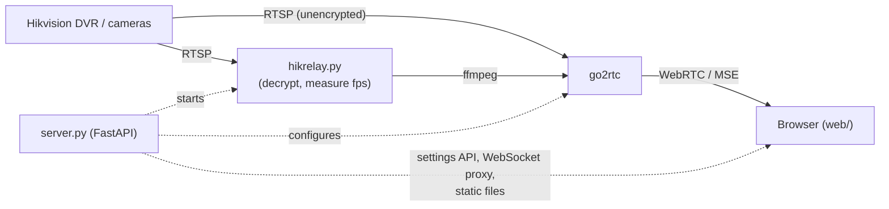

# Sentinel Eye

A self-hosted web dashboard for Hikvision recorders and cameras — live viewing, DVR playback and review,
event search, exports, and real-time AI-assisted enhancement, all running on your own machine.

<br clear="left">

No Hikvision app, no plugin, and no cloud account. It reads the recorder's standard RTSP streams over your
LAN and, when the recorder's proprietary "Stream Encryption" is turned on, decrypts them itself (the scheme
was reverse-engineered from scratch — see `tools/NOTES.md`). Nothing about how you watch or review your
cameras ever leaves your network.


*(Screenshot uses generic placeholder scenes and camera names, not real footage — see [Installing as an
app](#installing-as-an-app) for what it looks like installed on a phone or a TV.)*

## Why

Hikvision's own apps and cloud are the alternative to this project, not a neutral baseline. Sentinel Eye
exists to replace them outright: everything the vendor's software does — live view, recorded playback,
motion/event review, clip export, and increasingly AI-assisted analysis — running entirely on hardware you
control, with the recorder's proprietary encryption decrypted locally instead of trusted to a vendor plugin.

Built for my own needs, not as a multi-user product: there's no login system, and it's meant to run on
`127.0.0.1` or a network you already trust, not to be exposed publicly.

## Features

### Live view
- Grid layouts from 1x1 up to 4x4, plus 1+5, 1+7 and 2+8 (one large tile, several small ones); multiple
  pages when you have more cameras than fit on one screen, with auto-rotation between pages.
- Drag tiles to reorder them ("Arrange" mode); the order is saved and used everywhere else in the app.
- Per-tile SD / HD / Auto quality (Auto uses HD only for large tiles, SD for small ones, to keep bandwidth
  sane on a big wall of cameras).
- A large "focus" view for any camera, with snapshot, full screen, and camera-to-camera navigation.
- Zoom and pan on any tile or the large view — scroll wheel, trackpad pinch, touch pinch, mouse drag, or the
  on-screen controls — without ever pausing the picture.
- Instant replay: jump back up to a configurable window on any live camera without leaving the grid.
- Live event badges (motion, line-crossing, tamper, video loss) painted directly onto the relevant tile.
- **Channel-zero** (Settings → Connection, on recorders that support it): the recorder's own single-stream
  overview of every camera at once — the same picture a monitor plugged straight into it would show. An
  "Overview" toggle in the live view shows it as the first tile — off by default on a phone, tablet, or
  laptop; TV mode always shows it, full screen, since a single low-bandwidth stream is exactly what a weak
  TV browser wants. It has no recording of its own, so there's no instant replay for it, and bookmarking it
  bookmarks every real camera at once instead.
- **TV mode** (Settings → Display): a bigger, remote-friendly layout for watching from a smart TV's browser
  or just a bigger screen — larger text, arrow-key camera selection, page switching and an exit button while
  full screen, and SD by default to keep a weaker TV browser smooth (HD is a real, working choice from the
  same quality control, not just cosmetic). Defaults straight into Channel-zero's single-stream view when
  your recorder offers it. Per-browser, so turning it on for the TV doesn't change anything on your phone or
  laptop. More on this in [Installing as an app](#installing-as-an-app).

### Playback and review
- Review up to four cameras at once, frame-locked — the recorder's own hard limit on simultaneous playback
  sessions, not a limit this project imposes.
- A zoomable, scrollable timeline showing recorded coverage and events per camera, click-to-seek, and
  frame-accurate stepping forward and backward.
- Variable speed from 1/8x up to 16x, rewind macros, and a "select a range" tool for exporting exactly the
  footage you need.
- A multi-cut clipper: build a list of ranges from several points in the timeline, then export them all as
  one batch.
- Bookmarks and incident notes you can attach to a moment on any camera, searchable later.

### Event search
- Search motion, line-crossing, tamper and video-loss events (and your own bookmarks) across cameras and
  date ranges, with thumbnail or list views and a quick in-page preview before committing to a full export.

### Export
- Every export is a stream copy of the original footage — no re-encoding, no quality loss.
- **Signed evidence package** (recommended): the clip, a `manifest.json` covering every file's SHA-256 hash,
  the exact camera and DVR time range, and an Ed25519 signature over that manifest, plus an offline
  `verify.html` that checks it all in a browser with nothing installed and no server involved.
- **Plain MP4/MKV**: just the clip, for a quick look.

### Real-time enhancement ("the wand")
A WebGL filter chain that runs live, on the playing picture, at zero cost when switched off:
brightness/contrast/gamma, edge-aware sharpen, noise reduction, dark-channel-inspired dehaze, CLAHE-style
local contrast, digital WDR (highlight rolloff for backlit scenes), single-scale Retinex illumination
correction, temporal rain/snow-streak reduction, chromatic-aberration correction, and auto white balance
(corrects the color cast IR-lit night footage typically has). Every control is an independently adjustable,
stackable slider — presets are just one-click starting points, including one tuned for grainy, color-cast
IR night footage.

### AI frame enhancer
From a single paused frame (or a short burst, aligned and fused first for noise reduction), a local
Real-ESRGAN + GFPGAN pipeline produces the clearest, highest-resolution version of that moment it can —
useful for faces and license plates. It runs entirely on this machine, never calls out to the cloud, and
every output is explicitly labeled "ENHANCED" with the original frame always kept alongside it: the
distinction between "what the sensor recorded" and "the AI's best reconstruction of it" is never blurred.

### Settings
Recorder address and login, the encryption toggle and verification code, per-channel names/order/frame-rate
overrides and custom RTSP paths, a "detect channels" scan (also reads the recorder's own camera names),
theme and layout defaults, and live connection/engine status.

### Keyboard shortcuts

Live view (grid):

| Key | Action | | Key | Action |
|---|---|---|---|---|
| `1`-`9` | Open that camera | | `E` | Toggle arrange mode |
| `←` / `→` | Previous / next page | | `F` | Full screen |
| `Esc` | Leave arrange mode | | | |

Live view (large/focus view) and Playback:

| Key | Action | | Key | Action |
|---|---|---|---|
| `Space` | Play / pause (Playback) | | `S` | Snapshot (Live) |
| `←` / `→` | Previous / next camera (Live) | | `B` | Bookmark this moment |
| `,` / `.` | Step one frame back / forward (Playback) | | `H` | Toggle SD/HD (Live) |
| `+` / `-` / `0` | Zoom in / out / reset (Live) | | `F` | Full screen |
| `Shift` + `1`/`2`/`3` | Back 5s / 10s / 30s (Playback) | | `Esc` | Reset zoom, then close |
| `Shift` + `4`/`5`/`6` | Forward 5s / 10s / 30s (Playback) | | | |

## How it works


```mermaid
flowchart LR
    DVR["Hikvision DVR / cameras"] -- "RTSP" --> Relay["hikrelay.py<br/>(decrypt, measure fps)"]
    DVR -- "RTSP (unencrypted)" --> Go2rtc
    Relay -- "ffmpeg" --> Go2rtc["go2rtc"]
    Go2rtc -- "WebRTC / MSE" --> Browser["Browser (web/)"]
    Server["server.py (FastAPI)"] -. "settings API, WebSocket proxy,<br/>static files" .-> Browser
    Server -. "configures" .-> Go2rtc
    Server -. "starts" .-> Relay
```

The decrypting relay only runs when the recorder's Stream Encryption is turned on; otherwise go2rtc pulls
each camera directly. A few key files:

| File | Responsibility |
|---|---|
| `app/server.py` | FastAPI app: settings API, connection test, WebSocket proxy, static UI |
| `app/hikrelay.py` | The decrypting relay (`tools/NOTES.md` documents the reverse-engineered scheme) |
| `app/go2rtc.py` | Generates go2rtc's config from current settings and restarts it on change |
| `app/playback_session.py`, `app/timebase.py` | DVR playback sessions and the RTP-to-UTC clock calibration that makes multi-camera playback frame-locked |
| `app/export.py` | Stream-copy export, manifest generation, Ed25519 signing |
| `app/enhance_ai.py` | The local Real-ESRGAN/GFPGAN frame enhancer |
| `web/` | Plain ES modules, no build step, no framework |

SD streams stay connected at all times (needed for event/coverage indexing); HD streams start only when
actually viewed. HD is H.265 on the wire, transcoded to H.264 on this machine so it plays smoothly in every
browser — playing the original H.265 directly is an opt-in setting for lower CPU use.

That transcode asks go2rtc for a hardware encoder (`#hardware`), but the flag is a hint rather than a
guarantee: go2rtc uses a hardware encoder where it can find one and silently falls back to software
(libx264) where it can't. On the Linux host this was tested on, it chose libx264 even with a working
`h264_nvenc` present — so "hardware" there means CPU encoding at full resolution. Set
`SENTINEL_TRANSCODE_HW=0` to drop the flag outright, for a host whose hardware encoder is detected but
produces a broken stream.

## Running it

### Requirements
- macOS (Apple Silicon or Intel) or Linux, with a package manager for ffmpeg
- Python 3
- A Hikvision DVR/NVR or camera reachable over RTSP on your network

Built and tested on macOS first (that's the machine this was written for). Linux works too — the Python
backend and `go2rtc` are cross-platform, and `run.sh` now picks the right `go2rtc` binary for macOS or
Linux. Windows is still untested. See [Contributing](#contributing) below if you'd like to help with that.

### Install

macOS:

```sh
brew install ffmpeg
python3 -m venv .venv && .venv/bin/pip install -r requirements.txt
```

Linux (Debian/Ubuntu — substitute your distro's packages elsewhere):

```sh
sudo apt-get install -y ffmpeg python3-venv
python3 -m venv .venv && .venv/bin/pip install -r requirements.txt
```

That's it — `./run.sh` (below) fetches the right [go2rtc](https://github.com/AlexxIT/go2rtc) media-server
binary for your OS and CPU into `bin/go2rtc` the first time it runs, since that binary is arch-specific and
isn't committed to the repo. (Note the upstream fetch differs by OS: macOS assets are `.zip` archives, Linux
assets are bare binaries — `run.sh` handles both.)

### Configure

The first time you start it, Sentinel Eye seeds `data/settings.json` from a `.env` file in the project root,
if one exists:

```sh
DVR_HOST=192.0.2.10
DVR_USER=admin
DVR_PASS=your-password
DVR_KEY=your-stream-encryption-verification-code   # only needed if Stream Encryption is on
```

`.env` is only read on that very first run — after that, everything (recorder address, login, encryption,
channels, display options) is edited from the in-app **Settings** screen. `data/` holds your credentials
(file mode 600) and is git-ignored; never commit it.

### AI frame enhancer (optional)

Everything above is all you need for live view, playback, export, and the real-time "wand" filters. The
[AI frame enhancer](#ai-frame-enhancer) (Real-ESRGAN + GFPGAN, plus optional OCR) is a separate, heavier
opt-in — it pulls in PyTorch and ~1.5 GB of model weights, and one of its dependencies
([basicsr](https://github.com/XPixelGroup/BasicSR), effectively unmaintained since 2022) needs a couple of
small local patches to install and run on current Python. All of that is scripted:

```sh
tools/install_enhance_deps.sh
```

Run it once, any time after the base install above. If you skip this, everything else works normally; only
the frame-enhancer button will report it's unavailable.

### Run

```sh
./run.sh
```

Opens on **http://127.0.0.1:8007**. There is no login, so keep this on `127.0.0.1` or a network you trust —
do not expose it to the public internet. Set `SENTINEL_HOST`/`SENTINEL_PORT` to change the listen address:

```sh
SENTINEL_PORT=8090 ./run.sh
```

### Watching from your phone (or another device on your network)

```sh
SENTINEL_HOST=0.0.0.0 ./run.sh
```

Then, on your phone (connected to the **same Wi-Fi**), browse to `http://<this-machine's-LAN-IP>:8007` — find
the IP with `ipconfig getifaddr en0` (Wi-Fi) on macOS, or `hostname -I` (or `ip -4 addr`) on Linux.

Because there is still no login, this makes the dashboard — and your camera feeds — reachable by **anything
else on that network**, not just your phone: other devices on the same Wi-Fi, a guest network if it shares
the same subnet, or anyone who has the Wi-Fi password. Only do this on a Wi-Fi network you actually trust,
the same way you'd trust it with any other unauthenticated home device. Do not port-forward this to the
public internet.

### Stop

```sh
./stop.sh
```

Stops the web server, go2rtc, and any decrypt-relay/ffmpeg processes it started.

The frontend is plain JavaScript with no build step, so a UI change just needs a browser refresh; only a
backend (Python) change needs `./stop.sh && ./run.sh`.

### Running as a service (Linux)

`run.sh` is a foreground process — fine for a quick look, but it stops when the shell does. To keep Sentinel
Eye running (and start it at boot), two sample systemd units live in `tools/systemd/`:

```sh
# system-wide (runs as your user, survives reboot)
sed -e "s|__DIR__|$PWD|g" -e "s|__USER__|$USER|g" tools/systemd/sentinel-eye.service \
  | sudo tee /etc/systemd/system/sentinel-eye.service
sudo systemctl daemon-reload && sudo systemctl enable --now sentinel-eye

# or per-user, no root needed
mkdir -p ~/.config/systemd/user
sed -e "s|__DIR__|$PWD|g" tools/systemd/sentinel-eye.user.service \
  > ~/.config/systemd/user/sentinel-eye.service
systemctl --user daemon-reload && systemctl --user enable --now sentinel-eye
```

A per-user unit stops when your last session ends unless you enable lingering once
(`sudo loginctl enable-linger "$USER"`).

Both units keep the default loopback-only bind, restart on failure, and use `KillMode=control-group` so
stopping the service also takes down the go2rtc and ffmpeg children it starts rather than orphaning them on
their ports. Logs go to the journal (`journalctl -u sentinel-eye`).

## Installing as an app

Sentinel Eye installs as a standalone app on iPhone, iPad, and Mac — no App Store, just the browser's own
install mechanism:

- **iPhone / iPad (Safari):** Share → **Add to Home Screen**.
- **Mac (Safari, Chrome, or Edge):** the browser's install button, or Safari's **Add to Dock**.

It opens full-screen with its own icon and no address bar, and still talks directly to your own Mac over
your network — installing it changes nothing about how or where data moves.

<p align="center"></p>

### Channel-zero: the recorder's own overview

If your recorder supports it, Settings → Connection → **Channel-zero** turns on a single stream showing the
recorder's own multi-camera layout — the same picture a monitor plugged straight into it would show, at
whatever resolution the recorder itself encodes it at (confirmed directly against a real 8-channel NVR:
704×576, distinct from any individual camera's own main or sub stream). Once it's on, an **Overview** toggle
appears in the live view's toolbar — off by default, so enabling it on the recorder doesn't suddenly add a
tile to every device watching it. Turn it on and it becomes the first tile in the grid; a second toggle next
to it switches between that grid and Channel-zero filling the whole screen by itself. It isn't a real
recorded channel, so there's no instant replay for it, and bookmarking it bookmarks every real camera at
once instead — the closest honest equivalent to "this moment," since it has no timeline of its own to find
a bookmark on later.

### TV mode

Settings → Display → **TV mode** switches to a bigger, remote-friendly layout for watching on a smart TV's
browser (or just a bigger screen): larger text and camera names, arrow-key camera selection instead of a
mouse, and SD by default — most smart TV browsers (this was built and tested against Samsung's Tizen
browser) are far less capable than a phone or laptop and can lag under several simultaneous HD streams. HD
is a real, working choice one click away from the same quality control, not just a label. It's a per-browser
setting: turning it on for the TV doesn't change anything on your phone or laptop.

Turning it on offers to jump straight into it: if your recorder has Channel-zero, that confirmation also
turns it on (for every device watching this recorder, not just the one you're on — the dialog says so) and
takes you straight to it, full screen. A "Grid" toggle switches to the full camera grid (Channel-zero still
first) and back; while full screen, a small floating cluster (hidden until you move the mouse or remote)
handles paging and exiting.


Results on an actual TV browser vary with its hardware and how current the browser is — treat any given
smart TV as something to test, not a guaranteed target.

## Testing

```sh
tools/test_rig.sh start                              # isolated instance against a fake unencrypted camera
python tools/e2e_ui.py http://127.0.0.1:8081 <shotdir>   # ~40 browser checks via headless Chrome (CDP)
```

`tools/e2e_live.py` and `tools/e2e_real_settings.py` check against your real recorder without changing
anything on it.

## Project status

Live viewing, multi-camera DVR playback with frame-locked timing, event search, signed-package export, the
real-time enhancement filters, and the local AI frame enhancer are all built and in day-to-day use. The
detailed specification and its build status live in `docs/SPEC.md` — including the parts
deliberately not built (a native-DVR-file export option, and a standalone offline player), and one open
investigation into a rare timing edge case on footage recorded many hours before the most recent per-channel
clock calibration.

## Contributing

This started as a tool built for my own needs — my own Hikvision NVR, on my own Mac — so there's a lot of
surface it's never had a reason to cover. Contributions are welcome, especially in the areas that setup
above already admits are untested or missing:

- **Other DVR/NVR/camera brands.** Everything here assumes Hikvision's RTSP path conventions and ISAPI, and
  the encryption support (`tools/NOTES.md`) is specific to Hikvision's own scheme. A Dahua, Reolink,
  ONVIF-generic, or other vendor's equivalent would be a real, separate effort — genuinely useful, and not
  something this project currently attempts.
- **Windows support.** The Linux port landed first (see above); Windows is still untested. `run.sh` is a
  POSIX shell script, so it would need a `.bat`/PowerShell equivalent, and the go2rtc fetch would need the
  `go2rtc_win64.zip` asset — the Python backend itself has no obvious Windows blockers.
- **Features.** `docs/SPEC.md` documents what's built, what was deliberately left out, and why — a good
  starting point for seeing what's already been considered and what's genuinely open.

If you're picking up one of the bigger items (a new DVR brand, a new OS), consider opening an issue first to
compare notes before sinking a lot of time in — this project's own conventions (no build step for the
frontend, the settings/RTSP path assumptions baked into `app/hikrelay.py` and `app/go2rtc.py`) are worth
knowing going in.

## License

[MIT](LICENSE)
